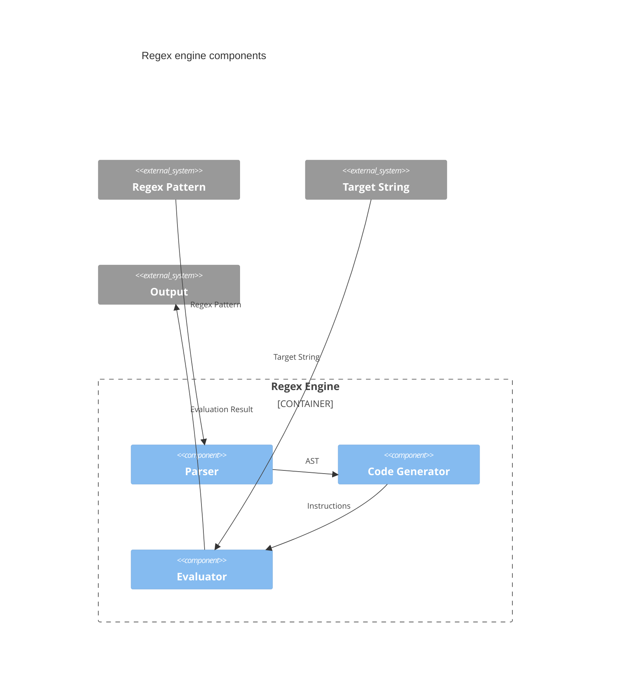

# Regex Engine in Swift

[Regex engine based on virtual machine approach](https://swtch.com/~rsc/regexp/regexp2.html) in Swift.

Simple component diagram:

```mermaid
C4Component
title Regex engine components
    System_Ext(pattern, "Regex Pattern")
    System_Ext(target, "Target String")
    System_Ext(output, "Output")

    Container_Boundary(engine, "Regex Engine") {
        Component(parser, "Parser")
        Component(codegen, "Code Generator")
        Component(eval, "Evaluator")

        Rel(parser, codegen, "AST")
        UpdateRelStyle(parser, codegen, $offsetY="-20")

        Rel(codegen, eval, "Instructions")
        UpdateRelStyle(codegen, eval, $offsetX="-30", $offsetY="-20")
    }

    Rel(pattern, parser, "Regex Pattern")
    UpdateRelStyle(pattern, parser, $offsetY="-30")

    Rel(target, eval, "Target String")
    UpdateRelStyle(target, eval, $offsetX="-30", $offsetY="-30")

    Rel(eval, output, "Evaluation Result")
    UpdateRelStyle(eval, output, $offsetY="-30")

```
